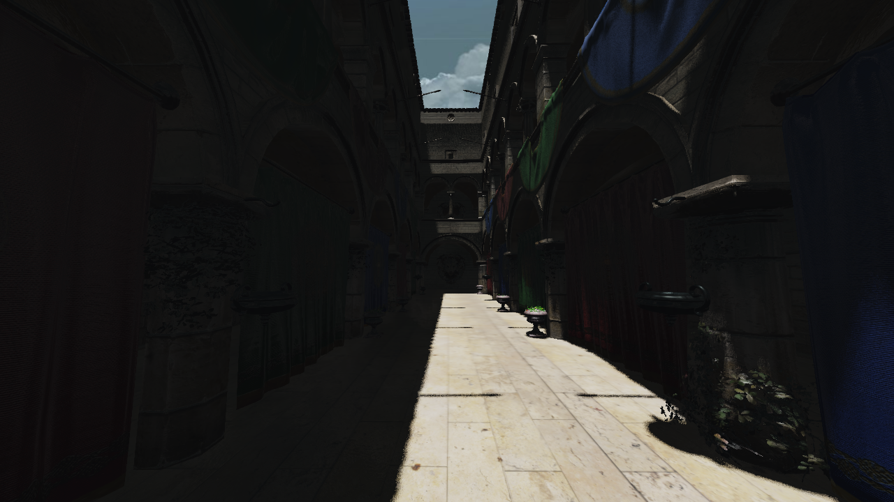

# Model Viewer

3D viewer based on [Aka engine](https://github.com/antaalt/Aka).

## Features
- Support many model format with Assimp
- Deferred rendering
- Shadow mapping (CSM)
- Directional lights & point lights
- Normal mapping
- PBR rendering
- FXAA
- Skybox

## Roadmap
- Correct blending & transparent rendering
- Add SSAO as ambient occlusion
- Add spot light / point lights
- Add ray tracing shadows / lightings
- Add scene graph and UI
